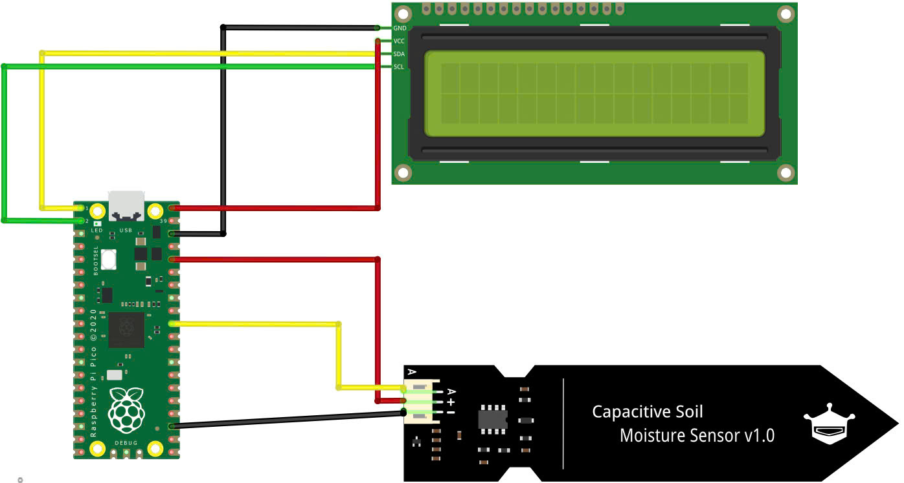
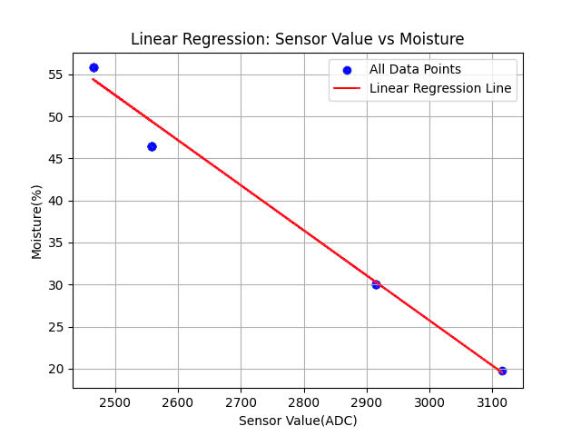

# Soil Moisture Monitoring with Raspberry Pi Pico

This project utilizes a capacitive analog soil moisture sensor and a Raspberry Pi Pico to monitor soil moisture levels, enabling efficient irrigation.

## Objective

To provide farmers with real-time soil moisture data, optimizing watering schedules and promoting healthy plant growth.

Project idea credit: [Microsoft IoT For Beginners - Detect Soil Moisture](https://github.com/microsoft/IoT-For-Beginners/tree/main/2-farm/lessons/2-detect-soil-moisture)

## Files Structure
```
Soil-Moisture/
├── src/
│   ├── assets/
|       ├── graph/
|       └── img/
│   ├── main.cpp
|   └── main.py
├── LICENSE
└── README.md
```
## Requirements

### Hardware

* [Raspberry Pi Pico 1](https://www.raspberrypi.com/documentation/microcontrollers/pico-series.html#pico-1-family)
* Capacitive Analog Soil Moisture Sensor
* LCD 16x2 I2C
* Jumper Wires

### Software

* Thonny IDE: [Thonny Python IDE for beginners](https://thonny.org/)
* MicroPython for Raspberry Pico [MicroPython Pico](https://micropython.org/download/RPI_PICO/)

Check out [Raspberry Pi Pico Python SDK](https://datasheets.raspberrypi.com/pico/raspberry-pi-pico-python-sdk.pdf) for more information.

### Dependencies
The project requires the following libraries: `pico_i2c_lcd.py` `lcd_api.py`

You will need to download these files and copy them to your Raspberry Pi Pico's filesystem using Thonny.

You can find the library and instructions on how to install it here: [RPI-PICO-I2C-LCD](https://github.com/T-622/RPI-PICO-I2C-LCD)

## Setup

### 1.  **Hardware Connection:**
   
Connect the soil moisture sensor to the Raspberry Pi Pico according to the provided circuit diagram.

Connect the I2C LCD to the Raspberry Pi Pico.
  


### 2.  **Software Setup:**

Download dependencies and install Thonny IDE.

Flash the Raspberry Pi Pico with MicroPython firmware.

Upload the MicroPython code at [main.py](./src/main.py) to the Pico via Thonny. The MicroPython code reads analog values from the soil moisture sensor and processes them to determine the soil moisture level.

> [!note]
> In the `src` folder, there is another `main.cpp` file which is only suitable with Arduino microcontroller and Arduino IDE.
> 
> We only include it here for reference.
> 
  
### 3.  **Sensor Calibration:**

Use the gravimetric method to calibrate the sensor. This involves measuring the weight of water per unit weight of dry soil (kg water/kg dry soil).

We did a simple experiment to measure 4 real soil samples and record the data including weights of wet soil, dry soil, and sensor reading values for the purpose of calibration. Here is the experiment video: 

With the actual data gathered from the abovementioned experiment, here is the linear graph that matches sensor reading values from 0 - 4095 with actual moisture percent present in the soil sample. This is the code [moisture_linear.py](./src/assets/graph/moisture_linear.py) to generate the graph below.




